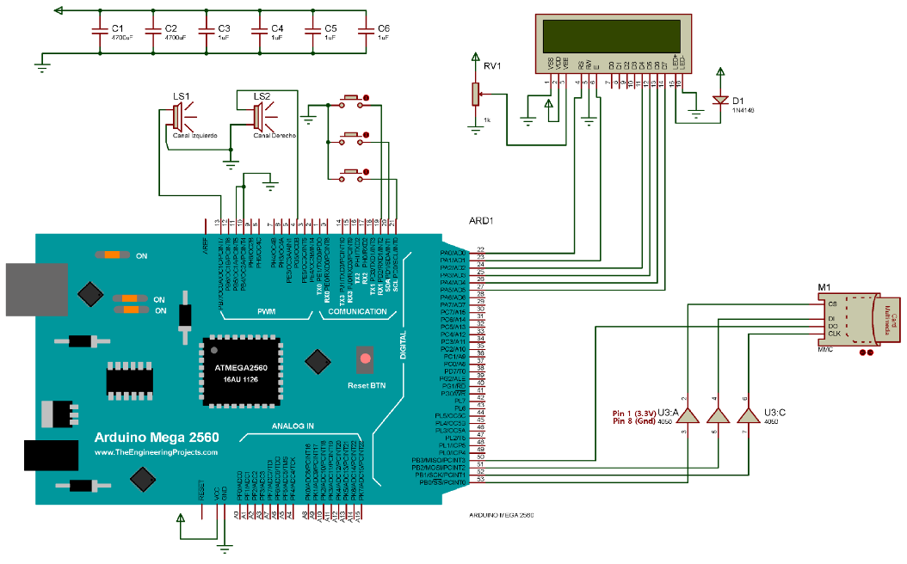

# WAV_player

This system has the following functions:

- Play songs in WAV format from an SD card, either mono or stereo.
- Capable of playing 6 KHz, 22.050KHz o 24 KHz of sampling rate
- Print song information in LCD display
- Play 6 different songs
- Pause/play, skip and rewind buttons

https://www.youtube.com/watch?v=SABbzT6F7_s 
